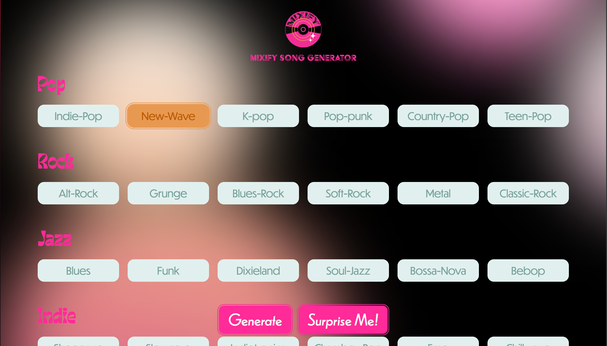
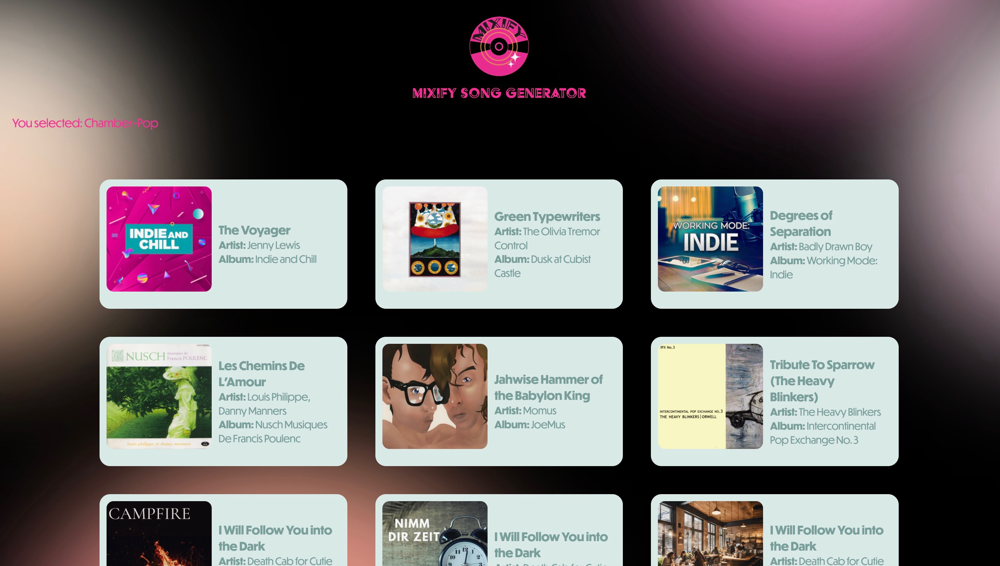

# Mixify

## Pictures of the project

## How to run this project

1. Make sure you have Node.js (v20+) installed.

2. From the project folder, install dependencies:

   npm install (type this in terminal)

3. Create a .env file (must be named ".env") in the spotify-backend folder with the following:

   CLIENT_ID=your_spotify_client_id
   CLIENT_SECRET=your_spotify_client_secret
   REDIRECT_URI=https://localhost:8888/callback
    
   (I will give you the ID and secret, just lmk when you need it)
   Replace "your_spotify_client_id" with the actual information

4. Start the server:

   node index.js

The server will run at http://localhost:8888
